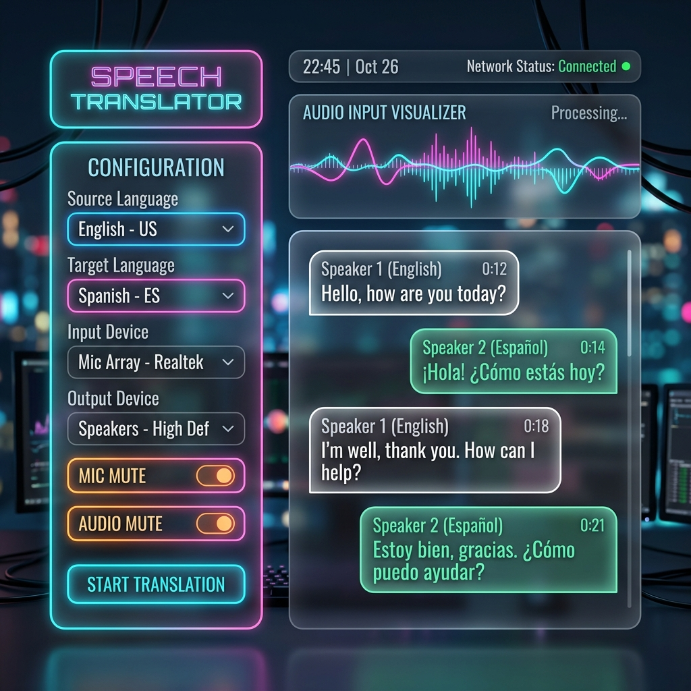
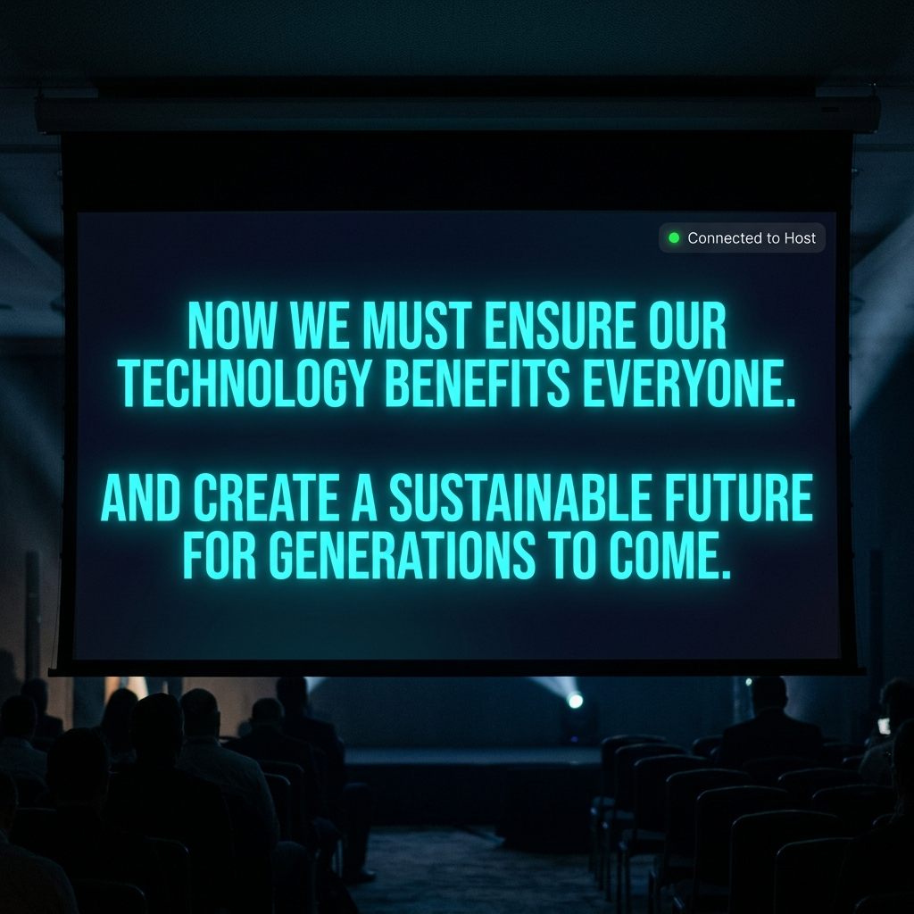

# Gemini Live Translate - Real-time Voice Interpreter

A sleek, low-latency, real-time voice-to-voice translation web application powered by the Google Gemini Multimodal Live WebSocket API (`v1alpha`). 

This application supports dual-language concurrent translations, visual waveform analytics, audio play/mute controls, remote network audio streaming from a separate computer, and a dedicated local network projector screen for sharing rolling subtitles on another laptop in real-time.

---

## 📸 Screenshots

### 1. Main Translation Dashboard


### 2. Standalone Subtitles Projector Screen


---

## ⚡ Features

* **High-Fidelity Audio capture:** Captures microphone input or system audio loopback (from YouTube, video calls, etc.) at 16kHz PCM.
* **Low-Latency Spoken Responses:** Streams translated audio playback back at 24kHz using a jitter-free Float32 buffer queue.
* **Concurrent Dual-Language Translation:** Connects to two parallel Gemini Live WebSocket sessions to translate speech into two languages at the same time.
* **Visual Waveform Analysis:** Live HTML5 canvas waveforms showing microphone input volume and translation audio output.
* **Independent Mute Controls:** Toggle spoken translation audio for Language 1 and Language 2 independently.
* **Decoupled Local Speaker Routing:** Includes a "Local Speaker" toggle on the dashboard. Unchecking this silences translated speech on the host computer's speakers (preventing microphone feedback loop and stream bleed on streaming/broadcast PCs), while continuing to stream audio packets over the network to all projector and client pages.
* **Multi-Laptop Screen Sharing (Projector Support):** Expose a local network server over HTTPS and stream live subtitles to a second laptop connected to a projector.
* **Remote Network Audio Streaming:** Capture audio on a separate computer and stream it over the local network to the main translation server. Ideal for setups where the microphone is far from the translation laptop — just open the Audio Streamer page on the remote PC and select "Network Audio" on the dashboard.
* **Disconnect Detection:** When the remote audio sender disconnects unexpectedly, the dashboard instantly displays a warning banner so the operator knows the stream was interrupted.
* **Smart Dynamic QR Code:** Automatically resolves the host's local network IP to generate a scannable QR code directly on the dashboard. Any attendee or secondary device can scan it to instantly join the live translation session.
* **Premium Flat Theme Layout:** Restructured dashboard placing all settings and system instruction widgets in a clean, 4-column horizontal card front and center at the top of the viewport. Visualizers, transcript logs, and controls are stacked below. Accent styling has been polished into a modern flat blue theme (removing legacy purple elements).
* **AI Translation Hints:** Provide real-time "system instructions" to the AI interpreter via the dashboard before connecting (e.g. teaching it specific theological terminology, preacher's name, or formal translation styles).
* **Broadcast-Grade Subtitles Engine:** 
  * **Smooth-Typing Ticker Queue:** Instead of raw API text chunks popping onto the screen at once (causing jarring flashes), incoming text is buffered into a client-side queue and rendered smoothly word-by-word. The queue calculates dynamic backpressure speeds (e.g., automatically speeding up from 160ms/word to 30ms/word) to ensure zero lag.
  * **Semantic Line Locking & Pacing Pause:** Sentences are intelligently locked into an immutable visual history buffer. Line breaks are strictly calculated at true sentence boundaries (`.?!`), and the engine introduces a dynamic post-break pause (150ms to 350ms depending on queue depth) to give the reader a stable moment to digest the completed sentence before it shifts up.
  * **Active-Line Highlight Preservation:** The sentence-final word (e.g., ending with a period) is rendered and fully highlighted in bright white on the active line, only moving to dimmed history when the next sentence actually begins.
  * **Visual Hierarchy:** Premium high-contrast layout where the active typing line glows in bright white while historical lines recede into a dim 30% opacity.
  * **Instant State Synchronization & Auto-Reconnect:** Subtitle clients feature a 3-second auto-reconnect loop that recovers from server restarts. When a subtitle page first connects or is refreshed mid-session, it receives a synchronized history state which renders instantly to the screen, bypassing the fast-forward word queue animation.

---

## 🚀 Quick Start (Local Network & Projector Mode)

To run the application on **Laptop A** (capturing audio) and display subtitles on **Laptop B** (connected to the projector):

```bash
# 1. Clone the repository
git clone https://github.com/DorelRoata/LiveTranslation.git
cd LiveTranslation

# 2. Install dependencies
npm install

# 3. Start the local server
npm run dev
```

### Setup Instructions:
1. In the terminal, copy the network IP printed under the `Network` heading (e.g., `https://192.168.1.67:5173/`).
2. Open that network URL on **Laptop A**.
3. In the configuration panel, copy the exact link shown under **Projector Screen Sharing** (e.g., `https://192.168.1.67:5173/subtitles.html`).
4. On **Laptop B** (the projector laptop), open that subtitles URL in Chrome, Edge, or Safari.
   * *Note: Because Vite uses a local self-signed SSL certificate, your browser will display a certificate warning. Click **Advanced** and then click **Proceed to ... (unsafe)** to open the subtitles page safely.*
5. Once Laptop B displays a green status dot in the top-right corner (meaning it is connected to the host), start translating on Laptop A. The subtitles will stream to Laptop B's projector screen in real-time!

### Remote Audio Setup (Optional):
If the microphone is on a **different computer** than the one running the translation server:
1. On the dashboard, select **"Network Audio (Stream from another PC)"** from the Audio Source dropdown.
2. A QR code and URL will appear for the **Audio Streamer** page (e.g., `https://192.168.1.67:5173/audio-sender.html`).
3. On the remote computer, open that URL in a browser. Accept the SSL certificate warning and grant microphone access.
4. Click **"Start Streaming"** on the Audio Streamer page. You should see the mic visualizer light up on both the streamer and the main dashboard.
5. Press **"Start Translation"** on the dashboard — audio from the remote PC will be translated in real-time!

---

## 🎥 OBS Live Stream Integration (YouTube / Twitch)

You can overlay the live translated subtitles directly onto a video feed in OBS Studio for live broadcasting. We have built a dedicated **OBS Broadcast Mode** that automatically hides the UI controls and sets a perfectly transparent background.

### How to set it up:
1. Open **OBS Studio** and add a new **Browser** source to your scene.
2. Set the **URL** to your local subtitle link, but add `?obs=true` to the end. 
   *(Example: `https://192.168.1.67:5173/subtitles.html?obs=true` or `https://localhost:5173/subtitles.html?obs=true`)*
3. Set the **Width** to `1920` and **Height** to `1080` (or match your stream's canvas resolution).
4. *(Optional)* If you want the translated text-to-speech audio to play through the stream, check **"Control audio via OBS"**. Otherwise, leave it unchecked if you only want the text overlay.

The subtitles will now perfectly float over your camera feed with smooth typing animations!

---

## 🔒 Recommended Browsers & macOS Settings

Modern web browsers restrict microphone access and display capture (`getDisplayMedia`) to **secure contexts** (`localhost` or `https`). Because Projector Mode runs over a local IP network, the server runs over HTTPS using a self-signed certificate.

For best compatibility, we recommend using **Google Chrome** or **Microsoft Edge**:
* **Microphone Permissions:** Allow microphone access in the browser prompt. On macOS, you may also need to check Google Chrome under **System Settings ➜ Privacy & Security ➜ Microphone**.
* **System Audio Capture (macOS):** To capture audio playing from another app or tab on macOS, toggle Google Chrome ON under **System Settings ➜ Privacy & Security ➜ Screen & System Audio Recording**.
