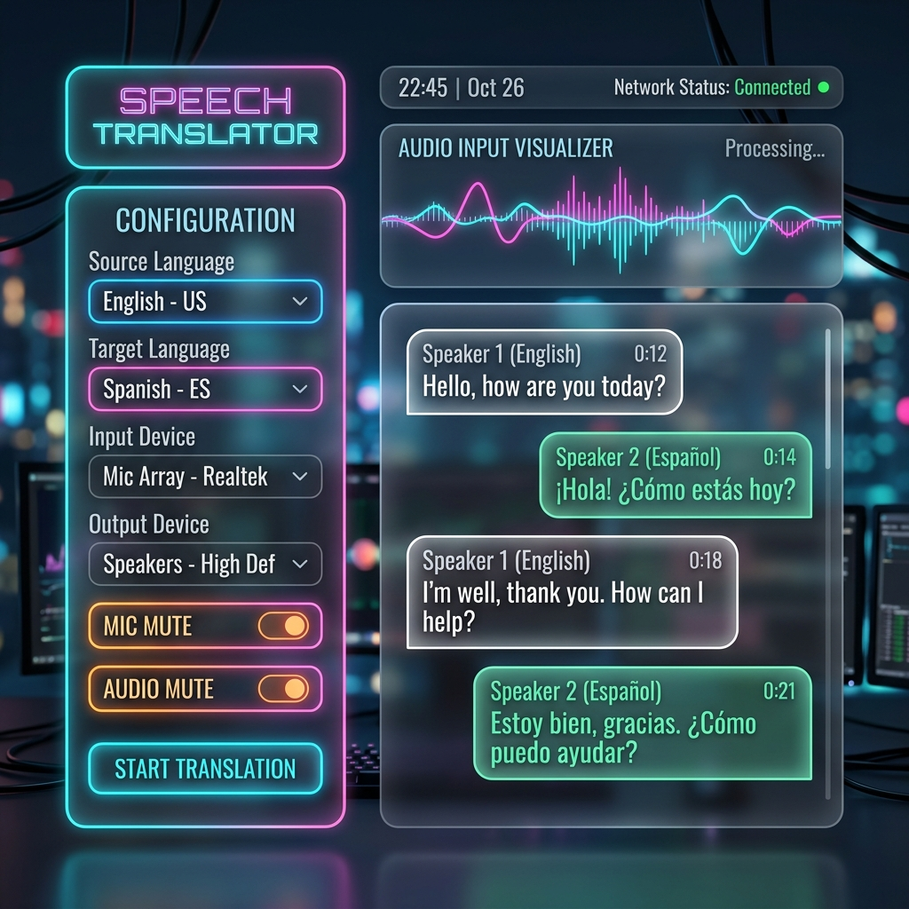

# Live Translate

Live Translate is a low-latency, real-time voice translation application powered by the Google Gemini Multimodal Live WebSocket API (`v1alpha`). It can translate one audio source into one or two target languages, play translated speech, and distribute rolling subtitles and audio to projectors, phones, and OBS across a local network.

The current application version is `v1.2.0`.

## Screenshots

### Translation dashboard



### Projector subtitles


## Highlights

- Microphone, system-audio, or remote network-audio input at 16 kHz PCM.
- One or two concurrent Gemini translation sessions.
- Low-latency translated speech playback at 24 kHz.
- Independent Voice 1 and Voice 2 output controls.
- A safety-oriented **Local Speaker** control that defaults to off.
- **Echo Target Language** defaults to off.
- Remembered operator settings with a **Reset Settings to Defaults** button.
- A projector/phone subtitle page with wake lock and automatic reconnection.
- A certificate-free OBS Browser Source endpoint on local HTTP port `5174`.
- A remote microphone page for another computer or phone.
- Connection health, diagnostics, manual recovery controls, and safe Mac updates.
- A gunmetal-gray dashboard with coral, amber, and green status accents.

## Network addresses and ports

| Purpose | Protocol and port | Typical address |
| --- | --- | --- |
| Local dashboard | HTTPS `5173` | `https://localhost:5173/` |
| Projector/phone subtitles | HTTPS `5173` | `https://192.168.1.67:5173/subtitles.html` |
| Remote microphone | HTTPS `5173` | `https://192.168.1.67:5173/audio-sender.html` |
| OBS Browser Source | HTTP `5174` | `http://192.168.1.67:5174/?obs=true` |

Use `localhost` only on the Mac that is running Live Translate. Other computers must use the network address displayed by the dashboard.

The dashboard, API-key configuration, projector page, and microphone page remain on HTTPS. The OBS-only listener uses HTTP because OBS can silently reject the application's self-signed HTTPS certificate. Port `5174` exposes only the subtitle overlay, its compiled assets, and the subtitle WebSocket; it does not expose the dashboard or configuration API.

## Requirements

- Node.js `20.19` or newer in the Node 20 line, or Node.js `22.12` or newer.
- npm and Git.
- A Gemini API key.
- Chrome, Edge, or Safari for the dashboard and shared browser pages.
- Both computers on the same local network for projector, remote microphone, or remote OBS use.

## Quick start

```bash
git clone https://github.com/DorelRoata/LiveTranslation.git
cd LiveTranslation
npm ci
npm run start:app
```

Open `https://localhost:5173/` on the host Mac. Enter the Gemini API key once; later launches load it automatically.

For source development with hot reload:

```bash
npm run dev
```

## macOS Dock app

After cloning the repository and running `npm ci`, double-click:

```text
install-mac-app.command
```

The installer places `Live Translate.app` in `~/Applications` and links it to the current repository. You can drag that app to the Dock.

The Dock app:

- Finds a compatible Node.js installation.
- Checks dependency integrity and installs missing dependencies when necessary.
- Builds the production dashboard when required.
- Starts the HTTPS dashboard on port `5173` and the OBS overlay on port `5174`.
- Waits for the dashboard to become ready before opening it.
- Writes startup output to `~/Library/Logs/LiveTranslate.log`.
- Protects local or diverged Git work from automatic updates.

If Live Translate is already running, clicking the Dock icon does not start another server or reload the active dashboard. It displays an **Already Running** dialog. Choose **OK** to leave the session untouched or **Open Dashboard** to navigate to it deliberately.

Do not delete or move the linked repository. If it moves, run `install-mac-app.command` again from the new location. This is one of the few cases that requires reinstalling the Dock app.

## Updating the Mac app

Normal code updates do **not** require reinstalling `Live Translate.app`.

To install an update:

1. Stop the running translation session and quit Live Translate.
2. Reopen the Dock app.
3. Choose **Update and Start** when prompted.

The update check runs only when no Live Translate server is already running. When an update is approved, the launcher performs a fast-forward-only pull of `origin/main`, installs locked dependencies with `npm ci`, builds the dashboard, and starts it. Interrupted updates use transaction markers and backups so the previous revision can be recovered safely.

The **Check Updates** control in Connection Health reports whether a newer commit is available. If it finds one, quit and reopen the Dock app to install it.

## Saved settings and safety defaults

The Gemini API key is stored in the current user's private application configuration at:

```text
~/Library/Application Support/LiveTranslation/config.json
```

The file is created with user-only permissions. API-key configuration is available only from the host computer.

Operator preferences are stored in browser storage for the dashboard origin. They are saved as soon as they change and restored on the next dashboard load. This includes the audio source and microphone, languages, voice-output switches, system instructions, Echo Target Language, Local Speaker, local volume, and transcript font size.

Important defaults include:

- Local Speaker: off.
- Echo Target Language: off.
- Audio source: system default microphone.
- Language 1: English.
- Language 2: disabled.
- Voice 1 and Voice 2 output: on.
- Local volume: 100%, but silent while Local Speaker is off.
- Transcript size: medium.

**Reset Settings to Defaults** restores operator preferences but deliberately keeps the saved Gemini API key.

Browser storage is scoped to the exact address. Use `https://localhost:5173/` consistently on the host Mac; a different browser profile or a network-IP dashboard address has separate browser settings.

## Projector and phone subtitles

Copy the **Projector Screen URL** from the dashboard. On the projector computer or phone:

1. Open the exact HTTPS URL.
2. Accept the self-signed certificate warning by choosing **Advanced** and proceeding.
3. Wait for the green connection indicator.
4. Start translation on the dashboard.

Subtitle viewers automatically reconnect after network or server interruptions and receive the current subtitle history after reconnecting. Wake lock can keep supported phone screens awake.

## Remote microphone

1. Select **Network Audio (Stream from another PC)** as the dashboard audio source.
2. Copy or scan the **Network Audio Sender URL**.
3. Open it on the remote computer or phone and accept the certificate warning.
4. Grant microphone access and select **Start Streaming**.
5. Start translation on the host dashboard.

The dashboard warns the operator if the remote sender disconnects and clears the warning when it reconnects.

## OBS live-stream overlay

1. In OBS, add a **Browser** source.
2. Copy the dashboard's dedicated **OBS Overlay URL**. It resembles `http://192.168.1.67:5174/?obs=true`.
3. Set the Browser Source width and height to `1920 × 1080`, or match the OBS canvas.
4. Keep **Control audio via OBS** disabled for text-only output. Enable it only when translated speech should enter the OBS mix.

OBS mode hides controls and the connection indicator and makes the page background transparent. A completely blank overlay is expected before translated words arrive.

If the projector displays words but OBS does not, verify the `http://...:5174/?obs=true` address, confirm the source eye is enabled and above the video source, and use **Refresh cache of current page** in the Browser Source properties.

## Subtitle pacing

Shared subtitles use an automatic word queue:

- `160 ms` per word under a light queue.
- `110 ms`, `70 ms`, or `30 ms` per word as the backlog grows.
- A `350 ms` pause after a completed line under normal load.
- A shorter `150 ms` line pause when the queue must catch up.
- Sentence punctuation (`.`, `?`, `!`) and a 60-character fallback determine line locking.

This pacing affects displayed subtitles. There is currently no operator pacing selector and no separate speed control for Gemini's spoken translation.

## Browser and macOS permissions

Microphone and system-audio capture require a secure context, so the dashboard and shared capture pages use HTTPS with a locally generated certificate.

- Allow microphone access in the browser prompt.
- On macOS, enable the browser under **System Settings → Privacy & Security → Microphone** when necessary.
- For system audio, enable the browser under **System Settings → Privacy & Security → Screen & System Audio Recording**.
- If a remote browser displays a privacy warning for port `5173`, proceed only when the address matches the trusted Live Translate host on your local network.

## Troubleshooting and detailed operations

See [Operator Guide](./docs/OPERATOR_GUIDE.md) for the complete operating workflow, diagnostics, update recovery, OBS checks, saved-setting behavior, and common failure cases.
